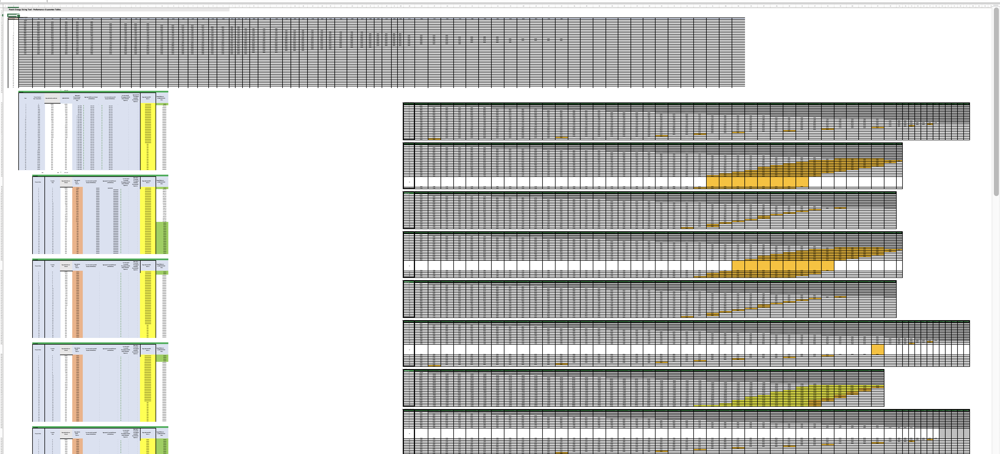

# Powering Energy Storage Beyond Excel {.r-fit-text .semi-filtered data-background-image="images/storage01.png"}
#### Calvin Hendryx-Parker, CTO
#### Six Feet Up

::: notes
Quick intro and that we will be showing a case study, but will have a live demo
:::

# GitHub Repository

<https://github.com/sixfeetup/2023_DjangoConUS_PoweringEnergyStorage>{.r-fit-text}

# Energy Storage Projects {.semi-filtered data-background-image="images/sungrow-emea-itv-MC5S6cU-unsplash.jpg"}

## Stages

- Project/System Requirements
- Sizing
- Configuration
- Build
- Maintain

::: notes
- Every project is a multi step process
- Usually calculation for 20 to 25 years lifecycle
- Calculate required hardware components to fulfill contract
- Predict system degradation over defined period of time
- Calculate tranches; new hardware that needs to be added at a particular point in time to keep system above minimum requirements
- Don’t add too much hardware upfront; too expensive
:::

# Why Excel in First Place {.semi-filtered data-background-image="images/solar01.png"}

- Widely known
- Easy to bootstrap
- Easy to adjust to business case
- Easy collaboration and sharing
- Handling of massive tabular data
- Handle complex formulas and business logic
- High precision calculations

::: notes
- Brief background on why Excel is used so much in first place
- Many companies build their business on Excel
- Explain the features that can be used for businesses:

  - Easy sharing and collaboration
  - Rich set of formulas
  - Fast calculations
  - Use references across multiple sheets
  - Include external data
  - Macros (now also with Python)
:::

# Tables...

::: notes
- Lots of tables everywhere
:::

# Why <ins>NOT</ins> Use Excel {.semi-filtered data-background-image="images/dan-meyers-w6X7XaolqA0-unsplash.jpg"}

- No scaling
- No reliable versioning
- No protection of business know-how and internals
- No fault tolerance
- No field permissions
- No tests

::: notes
- Scaling: Use Excel for a handful of projects, but not for thousands of customers and projects (where each project is a separate Excel file)
- The “Which version are you working on?” problem
- “Versioning” by filename pattern or written as documentation in a sheet
- Securing business logic (sharing file accidentally with externals)
- Everyone can change the content of a cell and formula; no permission checks
- Everyone can see everything
- No tests for business logic
:::

# Why Django? {.filtered data-background-image="images/battery01.png"}

- Batteries Included
- Mature
- Secure
- Reliable
- Extendable
- Scalable
- Testable

::: notes
- Django includes everything to get started fast; also admin UI
- You can care about data and business logic first
- It is more than 10 years old
- Python, high security score
- Easily extendable with add-ons
- Horizontal scaling; use Celery for long running tasks, ...
- Easy to write unit tests
:::

# Our Stack {.semi-filtered data-background-image="images/wind02.png"}

- Django backend
- PostgreSQL database
- `djangorestframework` — DRF, Django REST-Framework
- `drf_spectacular` — OpenAPI
- `django-rest-framework-simplejwt` — JWT
- `django-filter` — Filter classes for DRF
- NextJS UI
  
::: notes
- django: easy to start (admin), Python, we know and use it for so long
- postgres: robust, reliable, scalable
- djangorestframework: THE default rest framework
- drf_spectacular: OpenAPI 3 schema generation for Django REST framework
- django-rest-framework-simplejwt: A JSON Web Token authentication plugin for DRF
- django-filter: filter down a queryset based on a model’s fields
:::

# Transition {.semi-filtered data-background-image="images/storage02.png"}

1. Evaluate
2. Prototype
3. Review
4. Build
5. Switch

::: notes
- The optimal stages for transition from Excel to custom app with Django

1. **Evaluate:** Inspect and document every formula, every dependency
2. **Prototype:** Re-build business logic (formulas) with Python. Use Jupyter notebooks for this
3. **Review:** Let customer review prototype with real world data
4. **Build:** Implement the prototype in Django
5. **Switch**: Replace Excel files with new Django App
:::

# Transition {.semi-filtered data-background-image="images/wind03.png"}

## Evaluate

- Collect <ins>ALL</ins> formulas
- Document them
- Add examples
- Add spreadsheet version information

::: notes
- Top priority: every formula in the spreadsheets needs to be documented
- Every formula needs valid and invalid examples (to know when to fail)
- Add information about the spreadsheet version (file version), the cell location, all precedents and dependents
- When possible link to Jupyter notebook example
:::

# Transition {.semi-filtered data-background-image="images/nasa-Q1p7bh3SHj8-unsplash.jpg"}

## Prototype

- Using Jupyter Notebooks
- Rapid development
- No full stack required
- Let customer test with real data
- Early feedback

<!-- TODO: Link notebook example -->

::: notes
- Can be easily shared and run locally
- No need to set up full stack to write and test business logic
- Let customers test with their real data (CSV import) and give early feedback
:::

# Transition {.semi-filtered data-background-image="images/solar02.png"}

## Build

- Custom cookiecutter template
- [https://github.com/sixfeetup/cookiecutter-sixiedjango](https://github.com/sixfeetup/cookiecutter-sixiedjango)
- Terraform and AWS
- Local K8S development
- Fast development, easy deployment

::: notes
:::

# Front-end {.semi-filtered data-background-image="images/battery02.png"}

- [NextJS](https://nextjs.org/) with [Ant Design](https://ant.design/)
- Batteries-included front-end
- Authentication, protected routes, API access
- Implementation against OpenAPI specification
- CSV & PDF exports
- Reports

::: notes
- NextJS:
  - Most popular React Framework
  - Support for client and server side rendering
  - Support for dynamic HTML streaming
  - File system routing
  - Supports server and client side data fetching
  - We can build internal api endpoints to securly connect to 3rd party APIs
- Ant Design
  - Is a React Component Library
  - Provides a set of common UI components we use on a regular base
  - Easy customization and theming
- OpenAPI:
  - We use the auto-generated OpenAPI docs from `drf_spectacular`
  - Even if backend implementation is not yet complete, API is already specified with all request and response params, and has examples (also for failed requests)
  - Allows building the frontend faster
- Exports
  - PDF exports for internal archive, or to give it to customers
  - CSV exports for parallel usage of web app and other Excel files in the process until migration complete
- NextJS and Ant Design allow us to create reports and charts with ease, for example the augmentation table and degradation graph
:::

# Challenges {.semi-filtered data-background-image="images/american-public-power-association-dR3Fb6dBEc0-unsplash.jpg"}

## General

- New spreadsheet versions
- Changes in the formulas
- Parallel usage of Excel and Django
- Requirement changes

::: notes
- People are constantly updating and optimizing Excel sheets; every new version results in re-evaluation
- Sometimes (small) changes in formulas without notice
- People are still working with Excel while app is built
- Constant change of business requirements is easier doable in Excel than updating code
:::

# Challenges {.semi-filtered data-background-image="images/wind01.png"}

## UI & UX

- Massive amount of tabular data
- Very long forms
- Don’t create a web version of Excel

# Conclusion {.semi-filtered data-background-image="images/solar03.png"}

- Use Django from beginning if you can
- Use Excel if you have to
- Transition to Django early

::: notes
:::

# Wrap up and Questions {.semi-filtered data-background-image="images/justin-casey-7B0D1zO3PoQ-unsplash.jpg"}

## Resources

* Six Feet Up Blog Post -- [How to Break Free from Excel](https://www.sixfeetup.com/blog/how-to-break-free-from-excel)
* <https://github.com/sixfeetup/2023_DjangoConUS_PoweringEnergyStorage>

## Find Me 😍

📩 <calvin@sixfeetup.com>  
🤝 <https://linkedin.com/in/calvinhp>  
✖️ [@calvinhp](https://x.com/calvinhp)  
🐘 [@calvinhp@fosstodon.org](https://fosstodon.org/@calvinhp)  
✍️ <https://sixfeetup.com/blog>
